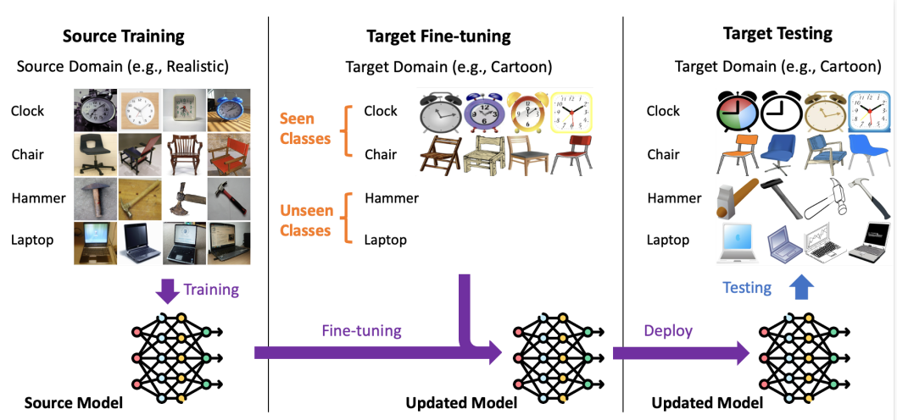
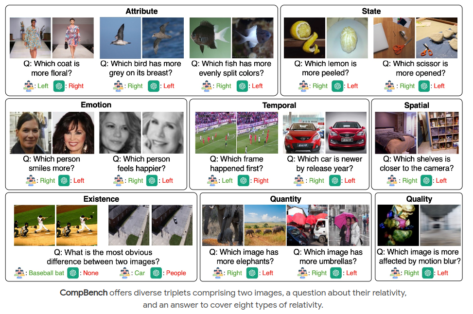

You can also find my articles on <a href="{{site.author.googlescholar}}">my Google Scholar profile</a> and latest submissions in the CV.

## Published Work
---

<i> \* == equal contribution </i>

### <b>[Fine-Tuning is Fine, if Calibrated]()</b>

Zheda Mai\*, <b>Arpita Chowdhury*</b>, Ping Zhang\*, Cheng-Hao Tu, Hong-You Chen, Vardaan Pahuja, Tanya Berger-Wolf, Song Gao, Charles Steward, Yu Su, Wei-Lun Cha

*The Thirty-eighth Annual Conference on Neural Information Processing Systems, 2024 (NeurIPS 2024)*

---

### <b>[CompBench: A Comparative Reasoning Benchmark for Multimodal LLMs](https://compbench.github.io/)</b>

Jihyung Kil, Zheda Mai, Justin Lee, Zihe Wang, Kerrie Cheng, Lemeng Wang, Ye Liu, <b> Arpita Chowdhury</b>, Wei-Lun Chao.

*The Thirty-eighth Annual Conference on Neural Information Processing Systems, 2024 (NeurIPS 2024)*

---

### <b>[INTR: A Simple Interpretable Transformer for Fine-grained Image Classification and Analysis](https://arxiv.org/pdf/2311.04157)</b>

Dipanjyoti Paul, <b>Arpita Chowdhury</b>, Xinqi Xiong, Feng-Ju Chang, David Edward Carlyn,
Samuel Stevens, Kaiya L. Provost, Anuj Karpatne, Bryan Carstens, Daniel Rubenstein,
Charles Stewart, Tanya Berger-Wolf, Yu Su, Wei-Lun Chao

*The Twelfth International Conference on Learning Representations, 2024 (ICLR 2024)*

---
## Under Review
### <b>PROMPT-CAM: A Simpler Interpretable Transformer for Fine-Grained Analysis</b>
<b>Arpita Chowdhury</b>, Dipanjyoti Paul, Zheda Mai, Jianyang Gu, Ziheng Zhang, Kazi Sajeed Mehrab, Elizabeth G Campolongo, Daniel Rubenstein, Charles V. Stewart, Anuj Karpatne, Tanya Berger-Wolf, Yu Su, Wei-Lun Chao.

---

### <b>Finer-CAM: Spotting the Difference Reveals Finer Details for Visual Explanation</b>
Ziheng Zhang, Jianyang Gu, <b>Arpita Chowdhury</b>, Zheda Mai, David Carlyn, Tanya Berger-Wolf, Yu Su, Wei-Lun Chao.

---

### <b>Static Segmentation by Tracking: A Frustratingly Label-Efficient Approach to Fine-Grained Segmentation</b>

Zhenyang Feng, Zihe Wang, Saul Ibaven Bueno, Tomasz Frelek, Advikaa Ramesh, Jingyan Bai, Lemeng Wang, Zanming Huang, Jianyang Gu, Jinsu Yoo, Tai-Yu Pan, <b>Arpita Chowdhury</b>, Michelle Ramirez, Elizabeth G Campolongo, Matthew J Thompson, Christopher G. Lawrence, Sydne Record, Neil Rosser, Anuj Karpatne, Daniel Rubenstein, Hilmar Lapp, Charles V. Stewart, Tanya Berger-Wolf, Yu Su, Wei-Lun Chao.

---

