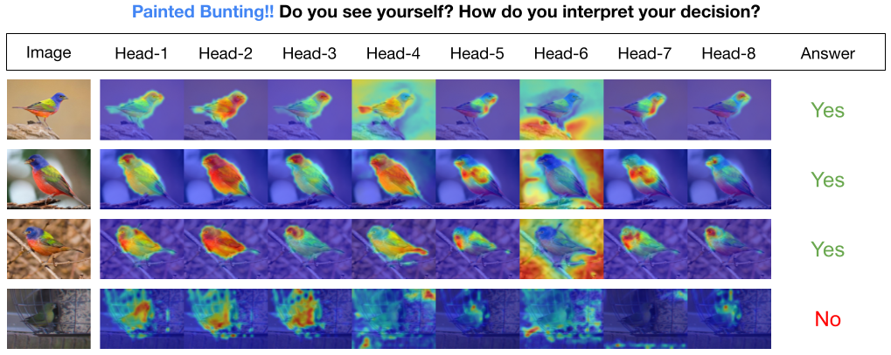

You can also find my articles on <a href="{{site.author.googlescholar}}">my Google Scholar profile</a>

## Published Work
---

### <b>[INTR: A Simple Interpretable Transformer for Fine-grained Image Classification and Analysis](https://arxiv.org/pdf/2311.04157)</b>

Dipanjyoti Paul, <b>Arpita Chowdhury</b>, Xinqi Xiong, Feng-Ju Chang, David Edward Carlyn,
Samuel Stevens, Kaiya L. Provost, Anuj Karpatne, Bryan Carstens, Daniel Rubenstein,
Charles Stewart, Tanya Berger-Wolf, Yu Su, Wei-Lun Chao

*The Twelfth International Conference on Learning Representations, 2024 (ICLR 2024)*

---
## Under Review 
---
<i> \* == equal contribution </i>

### <b>[Fine-Tuning is Fine, if Calibrated]()</b>

Zheda Mai\*, <b>Arpita Chowdhury*</b>, Ping Zhang\*, Cheng-Hao Tu, Hong-You Chen, Vardaan Pahuja, Tanya Berger-Wolf, Song Gao, Charles Steward, Yu Su, Wei-Lun Cha

*2024*

---

### <b>[CompBench: A Comparative Reasoning Benchmark for Multimodal LLMs](https://compbench.github.io/)</b>

Jihyung Kil, Zheda Mai, Justin Lee, Zihe Wang, Kerrie Cheng, Lemeng Wang, Ye Liu, <b> Arpita Chowdhury</b>, Wei-Lun Chao.

*2024*

